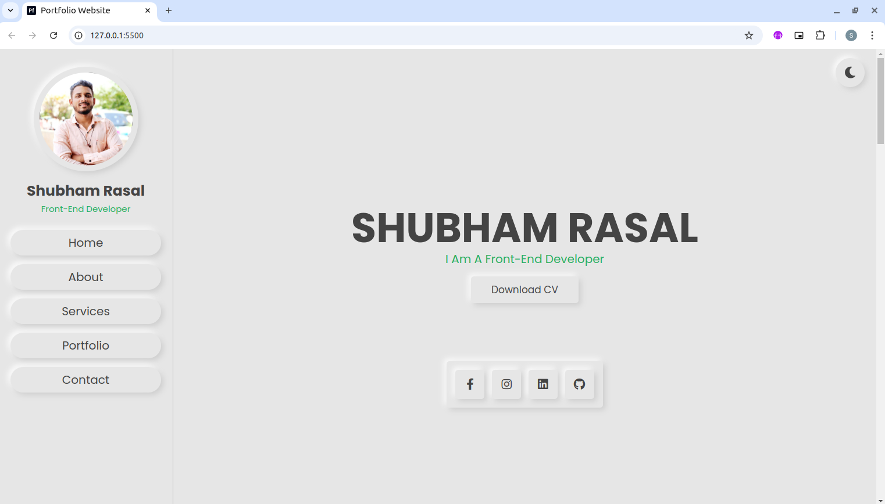
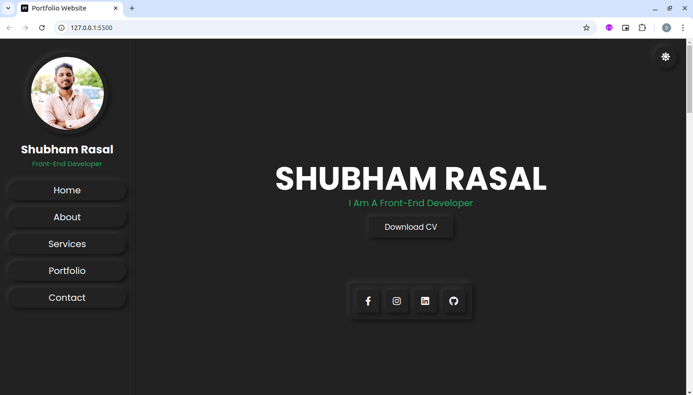
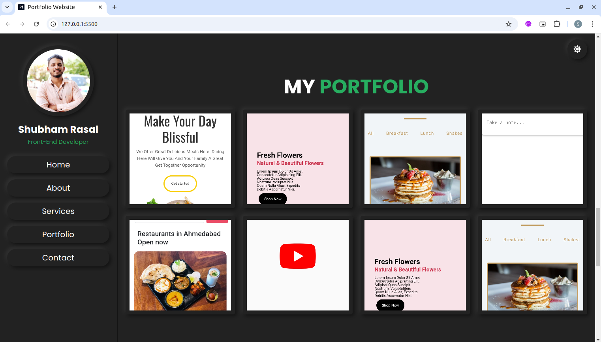
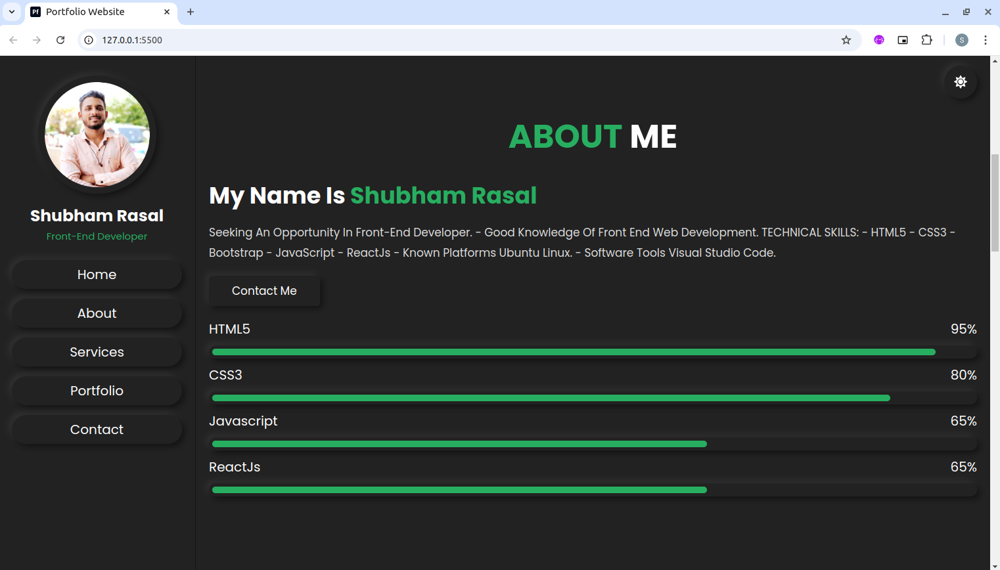
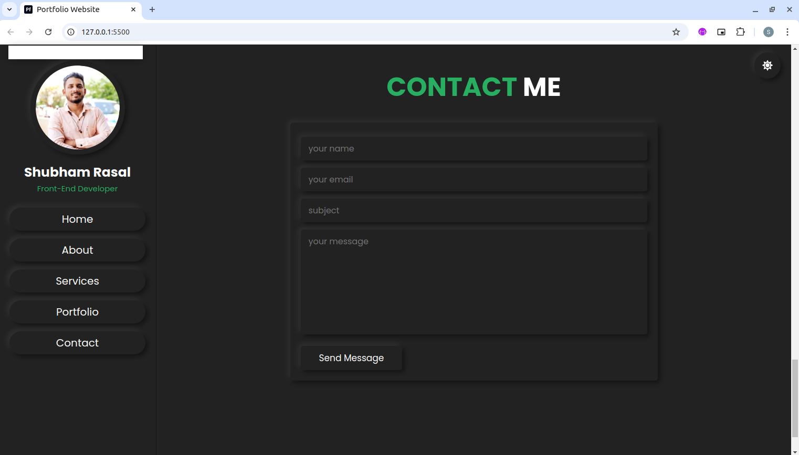

# Personal Portfolio Website

## Screenshot

This project is a Personal Portfolio Website designed with [HTML](https://developer.mozilla.org/en-US/docs/Web/HTML), [CSS](https://developer.mozilla.org/en-US/docs/Web/CSS), and [JavaScript](https://developer.mozilla.org/en-US/docs/Web/JavaScript) to showcase a professional’s work, skills, and contact information. The website includes sections like an “About Me” introduction, a portfolio gallery, skills overview, and a contact form. The design is clean and responsive, ensuring a smooth browsing experience on any device. JavaScript enhances interactivity with features like animated transitions, a dynamic project display, and smooth scrolling. This project is perfect for building an online presence and demonstrating web development skills.

## ⚙️ Languages or Frameworks Used

+ `HTML` 
+ `CSS`
+ `Javascript` 

## 🌟 How to run

Running the script is simple! run the following command:

Added vs code extension Go Live [here](https://marketplace.visualstudio.com/items?itemName=ritwickdey.LiveServer)

## 📺 Demo

[Personal Portfolio Website](https://shubham-portfolio2.netlify.app/)